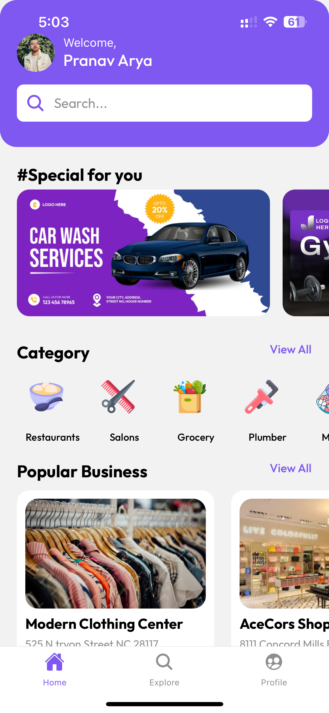

## Business Directory

A React Native mobile application built with Expo that allows users to discover and connect with local businesses. Users can search for businesses by category, view business details like address, phone number, website and reviews, and even add their own businesses to the directory.

### Table of Contents

- [Features](#features)
- [Screenshots](#screenshots)
- [Installation](#installation)
- [Usage](#usage)
- [Technologies Used](#technologies-used)
- [Contributing](#contributing)

### Features

- **Business Listing:** Browse a curated list of businesses categorized for easy exploration.
- **Business Details:** View comprehensive information about each business including name, image, phone number, website, address, about section, and user reviews.
- **Search Functionality:** Easily find specific businesses using the search bar.
- **Category Filtering:**  Quickly narrow down your search by selecting from various business categories.
- **Add Your Business:**  Grow your business by submitting it to the directory with details like images, contact information, and more.
- **User Reviews and Ratings:**  Get insights from other users through their reviews and ratings on businesses.
- **User Authentication:** Securely login and manage your profile using Clerk authentication with Google OAuth.

### Screenshots

<table>
  <tr>
    <td></td>
    <td></td>
    <td></td>
    <td></td>
  </tr>
  <tr>
    <td></td>
    <td></td>
    <td></td>
    <td></td>
  </tr>
  <tr>
    <td></td>
    <td></td>
    <td></td>
    <td></td>
  </tr>
</table>

### Installation

1. **Clone the Repository:**

   ```bash
   git clone https://github.com/your-username/business-directory.git
   cd business-directory
   ```

2. **Install Dependencies:**

   ```bash
   npx expo install
   ```

3. **Configure Firebase:**
   - Create a Firebase project and a web application.
   - Obtain the Firebase configuration object (apiKey, authDomain, etc.) from your project settings.
   - Create a `.env` file in the root directory and add your Firebase config:

     ```
     EXPO_PUBLIC_FIREBASE_API_KEY=YOUR_API_KEY
     EXPO_PUBLIC_FIREBASE_AUTH_DOMAIN=YOUR_AUTH_DOMAIN
     EXPO_PUBLIC_FIREBASE_DATABASE_URL=YOUR_DATABASE_URL
     EXPO_PUBLIC_FIREBASE_PROJECT_ID=YOUR_PROJECT_ID
     EXPO_PUBLIC_FIREBASE_STORAGE_BUCKET=YOUR_STORAGE_BUCKET
     EXPO_PUBLIC_FIREBASE_MESSAGING_SENDER_ID=YOUR_MESSAGING_SENDER_ID
     EXPO_PUBLIC_FIREBASE_APP_ID=YOUR_APP_ID
     EXPO_PUBLIC_FIREBASE_MEASUREMENT_ID=YOUR_MEASUREMENT_ID
     ```

4. **Configure Clerk Authentication:**
   - Create a Clerk account and an application.
   - Set up Google OAuth as a sign-in method within your Clerk application.
   - Add your Clerk Publishable Key to the `.env` file:

     ```
     EXPO_PUBLIC_CLERK_PUBLISHABLE_KEY=pk_YOUR_CLERK_PUBLISHABLE_KEY
     ```

5. **Start the Development Server:**

   ```bash
   npx expo start
   ```

### Usage

1. **Sign in:** Upon launching the app, you'll be prompted to sign in with your Google account.
2. **Browse Businesses:** Once signed in, you can explore the directory, view business listings, and access detailed information.
3. **Search:** Utilize the search bar to quickly find specific businesses.
4. **Add Business:**  Navigate to your profile and select "Add Business" to contribute a new listing.
5. **Logout:** Securely log out from the application through your profile settings.

### Technologies Used

- **React Native:**  A popular framework for building cross-platform mobile applications using JavaScript and React.
- **Expo:** A set of tools and services that simplifies the process of building, deploying, and iterating on React Native applications.
- **Firebase:** A comprehensive mobile and web app development platform by Google, used here for:
  - **Firestore:**  A NoSQL document database for storing and syncing data in real time.
  - **Storage:** A cloud storage service for storing user-generated content like images.
- **Clerk:**  A user management and authentication platform that simplifies handling user accounts and authentication.
- **Expo Router:**  File-based routing for Expo and React Native projects.
- **React Native Elements:**  A cross-platform UI toolkit for React Native.
- **Expo Image Picker:** A component for selecting and uploading images from a user's device.

### Contributing

Contributions are welcome! If you have any ideas, suggestions, or bug reports, please open an issue or submit a pull request.

Please ensure to follow the existing code style and provide clear documentation for your changes.
